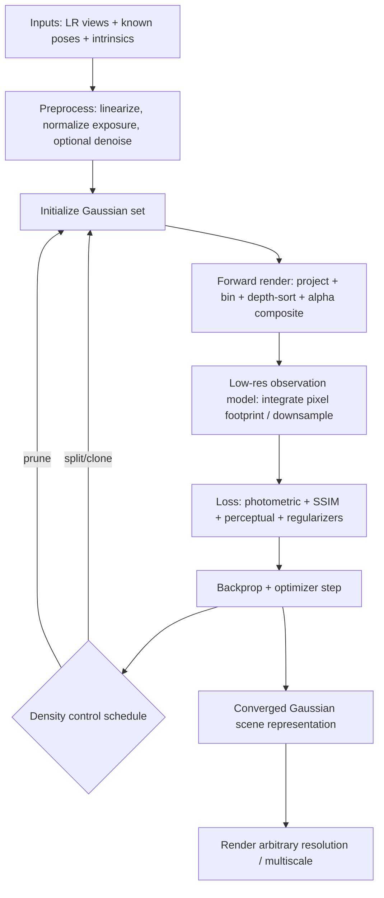

# State of the Art in Super-Resolution, Gaussian Splatting, and Continuous Scene Representations

## Executive summary

Single-image super-resolution (SISR) in 2020–2026 splits into two practical regimes: (a) **distortion-optimized** (high PSNR/SSIM on synthetic degradations) dominated by Transformer backbones such as **SwinIR** and successors, and (b) **real-world/blind SR** where perceptual plausibility dominates and methods like **Real-ESRGAN** and diffusion-based SR (e.g., **SR3**, **ResShift**, **SeeSR**) are preferred but typically slower and more stochastic. citeturn25view0turn31search3turn16search0turn16search10turn16search3

Multi-frame SR (video, burst) remains primarily a **learned alignment + fusion** problem. Recurrent propagation approaches like **BasicVSR++** are still highly competitive, while Transformer video restorers like **VRT** and **RVRT** emphasize long-range temporal dependency and alignment inside attention. citeturn23view0turn31search1turn31search2turn31search11turn31search8

For continuous 3D scene representations (multi-view, known poses), modern practice is dominated by two families:

- **Neural radiance fields / neural fields** (NeRF and variants): strong quality and principled volumetric rendering, but often **per-scene optimization** and expensive ray marching. Anti-aliasing and scale-aware supervision (e.g., mip-NeRF, mip-NeRF 360, Zip-NeRF) are key to robustness across resolutions. citeturn5search0turn5search1turn6search0turn5search3  
- **Point-based Gaussians (Gaussian splatting)**: particularly **3D Gaussian Splatting (3DGS)**, which couples an explicit Gaussian primitive set with a fast, tile-based, visibility-aware differentiable splat renderer; it is widely adopted because it provides **real-time 1080p rendering** and competitive quality, with typical trained scenes on the order of **~1–5 million Gaussians**. citeturn20view0turn18view0turn21view0

To super-resolve from **multiple low-resolution renders with known camera poses**, the most stable approach is to **optimize a continuous scene representation under an explicit low-resolution observation model** (i.e., render + low-pass/downsample to match LR), rather than attempting to “hallucinate” HR details in 2D first. Techniques from mip-NeRF (pixel footprint integration) and the anti-aliasing updates in the official 3DGS codebase are directly relevant for correctly handling multi-scale supervision. citeturn5search1turn18view0

Implementation with **entity["company","NVIDIA","gpu company"] Warp** is feasible because Warp provides: JIT-compiled GPU kernels, array utilities (scan/sort/run-length encode), autodiff via `wp.Tape`, and zero-copy interop pathways (Torch, DLPack, stream bridging). The main difficulty is reproducing the full 3DGS-style bin/sort/raster pipeline efficiently and (optionally) differentiably, because performance hinges on memory traffic, sorting, and atomic-heavy gradient accumulation. citeturn8view1turn11view0turn10view2turn12view1turn13view3turn7academia40

Camera pose estimation/refinement is **out of scope** here; the pipeline assumes accurate poses and intrinsics (or at least consistent relative poses). citeturn5search0turn20view0

## Taxonomy of methods and trade-offs

The table below is a **concise taxonomy** across 2D SR, multi-frame SR, and continuous 3D scene representations, emphasizing: input requirements, training vs test-time optimization, speed/memory, metrics, arbitrary-resolution capability, tolerance to slight camera offsets, and how naturally they connect to Gaussian splatting / neural fields. Representative primary sources include SwinIR, HAT, BasicVSR++, VRT/RVRT, Real-ESRGAN, LIIF, NeRF/mip-NeRF/Zip-NeRF/Instant-NGP, Plenoxels/TensoRF/K-Planes, and 3DGS/2DGS/4DGS. citeturn25view0turn27view1turn23view0turn31search1turn31search2turn31search3turn17search8turn5search0turn5search1turn5search3turn5search10turn6search10turn6search5turn6search11turn20view0turn4search32turn4search13

| Family | Representative methods (2020–2026) | Input & pose requirements | Training vs test-time optimization | Speed & memory profile (typical) | Quality metrics (representative) | Arbitrary output resolution | Handling slight offsets / misalignment | Compatibility with Gaussians / neural fields |
|---|---|---|---|---|---|---|---|---|
| Distortion-oriented SISR (PSNR SR) | SwinIR; HAT | 1 LR image; no pose | Offline train; fast feed-forward inference | Fast-ish, but can be heavy; tiling tricks for VRAM exist (HAT) | Example (×4, Set5): SwinIR ≈ 32.92 dB / 0.9044; HAT ≈ 33.04 dB (PSNR shown in repo) citeturn25view0turn27view1 | Usually fixed scales (×2/×3/×4) | N/A (single frame) | Can be used as preprocessing before SfM/3DGS, but risk of geometry-inconsistent hallucinations |
| Real-world / blind SISR | Real-ESRGAN; diffusion SR3/ResShift/SeeSR | 1 LR image; unknown degradation | Often offline train; inference ranges from fast (GAN) to slow (diffusion steps) | Diffusion can be orders slower; GAN-style faster | Metrics vary; perceptual quality emphasized; SeeSR targets semantics preservation for Real-ISR citeturn31search3turn16search0turn16search10turn16search3 | Fixed scale typically; diffusion sometimes supports variable but not “continuous” by design | N/A | Pre-enhancement can help texture but can harm multi-view consistency (especially diffusion hallucinations) |
| Arbitrary-scale 2D SR (continuous image SR) | LIIF and INR-style ASSR | 1 LR image; no pose | Offline train; inference queries continuous coordinate field | Can be efficient but query cost scales with output pixels; some methods trade accuracy for speed | LIIF explicitly targets continuous representation and arbitrary resolution outputs citeturn17search8turn17search0 | Yes (continuous coordinates) | N/A | Conceptually aligns with “continuous representation,” but it’s 2D (per-image), not 3D-consistent |
| Video SR (VSR) | BasicVSR++; VRT; RVRT | Multiple frames (temporal); no explicit 6-DoF pose | Offline train; feed-forward inference; some recurrent | High compute/memory depending on clip length; attention heavy | Example: BasicVSR++ reports PSNR/SSIM for compressed video enhancement (Table shown) citeturn23view0 | Usually fixed scales | Designed to handle motion/misalignment via flow/deformable alignment or attention citeturn23view0turn31search1turn31search2 | Works for temporal SR; for true parallax + viewpoint changes, 3D methods are superior |
| Burst / multi-frame SR (MFSR) | BSRT; NTIRE BurstSR line | Multiple short-exposure noisy frames; subpixel shifts | Offline train; inference feed-forward | Often expensive alignment + fusion; RAW pipeline costs | BurstSR explicitly optimizes PSNR/SSIM/LPIPS in benchmarks/challenges citeturn30search0turn30search2 | Usually fixed ×4 in benchmarks | Robust to subpixel shifts; explicitly models misalignment (flow + deformable conv in BSRT) citeturn30search2 | Useful front-end for denoise/demosaic, but still 2D-consistency limits for multi-view parallax |
| Classic NeRF (implicit neural field) | NeRF | Multi-view images + accurate poses/intrinsics | Per-scene test-time optimization (hours typical historically) | Slow rendering (ray marching many samples); memory mostly MLP/activations | Standard metrics PSNR/SSIM/LPIPS for NVS tasks citeturn5search0turn20view0 | Yes (continuous rays; arbitrary res) | Can exploit small viewpoint changes naturally if poses correct | Incompatible directly with Gaussians, but shares the “render-to-match” optimization loop |
| Anti-aliased / multiscale NeRF | mip-NeRF; mip-NeRF 360; Zip-NeRF | Multi-view + poses; cares about pixel footprint | Per-scene optimization; Zip-NeRF focuses on speed + quality | Faster than vanilla NeRF variants; still ray-based | mip-NeRF integrates conical frustums; Zip-NeRF combines grid speed with anti-aliasing citeturn5search1turn6search0turn5search7 | Yes | More robust to scale changes + resolution mismatch (critical for LR supervision) citeturn5search1turn5search7 | Conceptual template for LR→HR observation modeling useful for Gaussians |
| Fast explicit radiance fields | Instant-NGP; Plenoxels; TensoRF; K-Planes | Multi-view + poses | Per-scene optimization, but minutes (often) | Faster training using grids/tensors; memory in feature grids | Instant-NGP uses multires hash encoding; Plenoxels avoids neural nets; TensoRF factorizes tensors; K-Planes factorizes into planes citeturn5search10turn6search10turn6search5turn6search11 | Yes | Handles small view offsets well if poses accurate | Often used as baselines against 3DGS; share continuous rendering loop |
| 3D Gaussian splatting (point-based Gaussians) | 3DGS and variants | Multi-view + poses; typically SfM sparse points init | Per-scene optimization with densification/pruning; real-time render after | Real-time splat rasterization; trained models often 1–5M Gaussians | 3DGS reports per-scene PSNR/SSIM/LPIPS on Mip-NeRF 360 and Tanks&Temples/DeepBlending; enables real-time 1080p rendering citeturn20view0turn21view0turn18view0 | Yes (rasterize at any res) | Natural for small offsets; sensitive to pose errors (pose refinement separate) | Native representation for the requested pipeline |
| Geometry-aware Gaussian splatting | 2DGS (and descendants) | Multi-view + poses; aims at geometric accuracy | Per-scene optimization | Similar runtime class; adds ray-splat intersection & geometry constraints | 2DGS explicitly targets geometrically accurate radiance fields citeturn4search32 | Yes | As above | Useful if you need consistent depth/geometry (e.g., downstream meshing) |
| Dynamic Gaussians (4DGS etc.) | 4D Gaussians; Swift4D; others | Video + poses (and time) | Per-sequence optimization; deformation fields / 4D primitives | Higher memory; dynamic modeling cost | 4DGS targets real-time dynamic scene rendering; e.g., claims 30+ fps on RTX 3090 in project page citeturn4search13turn4search37turn4search11turn4search27 | Yes | Handles temporal changes; still pose-sensitive | Relevant if LR inputs are time-varying (not assumed here) |

## Gaussian splatting and neural fields

Gaussian splatting and neural fields can be viewed as two ends of a spectrum:

- **Neural fields (NeRF-family):** represent a continuous 3D function (radiance/density or related) and render via ray integration. The major scaling issues are (1) ray marching evaluations per pixel and (2) aliasing/scale mismatch between training views and test rendering (especially when training images are at mixed resolutions). mip-NeRF addresses aliasing by integrating over **pixel footprints (conical frustums)** instead of sampling infinitesimal rays, and mip-NeRF 360 extends this to unbounded scenes. Zip-NeRF further combines anti-aliasing ideas with grid-based acceleration while reporting large error reductions and much faster training than mip-NeRF 360. citeturn5search1turn6search0turn5search7turn5search3  
- **Gaussians (3DGS-family):** represent a scene as an explicit set of anisotropic 3D Gaussians with view-dependent color (often spherical harmonics). Rendering becomes **tile-based splat rasterization + alpha compositing** with depth sorting. The 3DGS paper highlights three key components: starting from sparse SfM points, interleaving optimization with density control (add/remove/split Gaussians), and a fast, visibility-aware renderer enabling real-time 1080p novel-view synthesis. citeturn20view0turn18view0  

A crucial data-point is that 3DGS includes a detailed error-metric appendix comparing to **Plenoxels**, **Instant-NGP**, and **mip-NeRF 360** on Mip-NeRF 360 scenes, reporting per-scene PSNR/SSIM/LPIPS and an average over the dataset (PSNR 27.58, SSIM 0.790, LPIPS 0.240, per the appendix text). citeturn21view0

2D Gaussian Splatting (2DGS) is a notable 2024 branch: it changes the primitive from 3D ellipsoids to 2D disks/surfels and explicitly computes ray-disk intersections, with the explicit goal of improving **geometric accuracy** in radiance field reconstruction. citeturn4search32turn4search24

Dynamic extensions (4DGS and later work) add time-dependent deformation or native 4D parameterizations; they matter if your LR renders are temporally varying rather than a static scene. citeturn4search13turn4search37turn4search11turn4search29

image_group{"layout":"carousel","aspect_ratio":"16:9","query":["3D Gaussian splatting radiance field rendering visualization","2D Gaussian splatting surfel rendering example","NeRF vs Gaussian splatting comparison illustration","tile-based splatting rasterization diagram"],"num_per_query":1}

## Pipeline from multi-view low-resolution renders to arbitrary-scale outputs via Gaussian splatting

This section describes a **concrete, pose-known** pipeline to: (1) ingest multiple LR renders with known camera poses, (2) optimize a Gaussian-splat scene representation under an LR observation model, and (3) render arbitrary-resolution outputs.

### Pipeline diagram

```
LR multi-view renders + intrinsics/extrinsics
        |
        |  (optional) linearize / HDR / exposure normalize
        v
Initialization of Gaussians (points -> Gaussians)
        |
        |  differentiable splat rendering with pixel-footprint modeling
        |  + low-res observation model (downsample / integrate)
        v
Optimize Gaussian parameters (pos, cov, opacity, SH color)
 + density control (split/clone/prune)
 + regularizers (anti-aliasing, depth/normal if available)
        |
        v
Arbitrary-resolution render (and optional multiscale mip rendering)
```

### Mermaid flowchart



### Inputs and preprocessing

**Inputs (assumed known/stable):**
- LR images \(I_k\) for cameras \(k = 1..K\)  
- camera intrinsics \(K_k\) and extrinsics \((R_k, t_k)\)  
- optional: per-view exposure metadata; optional depth/normal buffers if these are “renders” from an engine.

**Preprocessing recommendations (practical, not theoretical):**
- Work in a **linear color space** if you can (especially if your renders are HDR-ish), and only apply tone mapping after rendering for visualization.
- If exposure varies per view, add a lightweight **per-view affine color transform** during training (as in the “exposure compensation” option described in the official 3DGS repo). citeturn19view0turn18view0
- If the LR renders contain temporal AA / post-processing blur, try to disable it; Gaussian training benefits from a simpler forward imaging model.

### Initialization strategies

3DGS-style optimization typically starts from a point set and converts each point into a small Gaussian; the original 3DGS workflow initializes from the sparse points produced during camera calibration (SfM), then optimizes positions/covariances/colors with interleaved density control. citeturn20view0turn18view0

For your setting (“multiple LR renders with known poses”), you have several viable initializations:

1. **Sparse points from SfM/MVS** (if you also have feature-rich RGB and want traditional calibration): mirrors the canonical 3DGS setup. citeturn20view0turn18view0  
2. **Depth-assisted initialization** (if your renderer can output depth): backproject depth pixels to initialize points, which often accelerates convergence and reduces floaters.  
3. **Box-initialization + pruning** (least recommended): sample points in a bounding volume and rely on pruning; works but wastes compute.

### Forward model (rendering + LR observation)

Let the continuous scene representation be a set of \(N\) Gaussians \(\{G_i\}\). Each Gaussian has parameters:
- mean \(\mu_i \in \mathbb{R}^3\)
- covariance \(\Sigma_i\) (often parameterized by scale + rotation)
- opacity \(\alpha_i \in [0,1]\)
- view-dependent color \(c_i(\mathbf{v})\), commonly spherical harmonics (SH) coefficients. citeturn20view0turn18view0

**Rendering (camera \(k\))** projects each 3D Gaussian into a 2D elliptical footprint and alpha-composites splat contributions in visibility order using a tile-based rasterization and GPU sorting approach (core 3DGS idea). citeturn20view0turn18view0

**Critical for SR from LR inputs:** model the LR pixel as a **finite-area measurement** (a low-pass filtered sample), not a point sample.

Two practical approaches:

- **Pixel-footprint covariance addition (fast approximation):**  
  Approximate the pixel filter as a Gaussian with covariance \(\Sigma_{\text{pix}}\) in screen space, and render using \(\Sigma_{2D}^\prime = \Sigma_{2D} + \Sigma_{\text{pix}}\). This is analogous in spirit to mip-NeRF’s “integrate over footprint” concept, but adapted to Gaussian splatting. citeturn5search1turn20view0  

- **Stochastic supersampling + downsampling (robust, slower):**  
  Render at an internal resolution \(s\times\) (or sample \(m\) subpixel jitters per LR pixel), then downsample using a known kernel (box/Gaussian/Lanczos) to compare against LR. This emulates the “supersample then integrate” baseline that mip-NeRF argues is too expensive for NeRF but may be manageable for Gaussians at moderate \(s\), especially if you do Monte Carlo subpixel sampling instead of full \(s^2\) upscaling. citeturn5search1turn20view0  

### Losses and regularization

A robust training objective for LR-supervised Gaussian splatting typically includes:

**Photometric reconstruction (LR space):**
- Charbonnier or L1 in linear RGB:  
  \[
  \mathcal{L}_{\text{photo}} = \sum_k \left\| \text{Down}( \hat{I}_k^{HR} ) - I_k^{LR} \right\|_1
  \]
- (Optional) SSIM term for structure:
  \[
  \mathcal{L} = \lambda_1 \mathcal{L}_{\text{photo}} + \lambda_2 (1-\text{SSIM})
  \]

**Perceptual terms (optional, risky for multi-view consistency):**
- LPIPS can help visually, but it can encourage view-inconsistent hallucinations if weighted too high. Note that 3DGS evaluation commonly reports LPIPS alongside PSNR/SSIM. citeturn21view0

**Anti-aliasing / multi-scale robustness:**
- Multi-scale supervision: render at multiple scales and match corresponding downsampled targets (or apply a scale-appropriate pixel-footprint model). This is the same conceptual problem that mip-NeRF formalizes for radiance fields. citeturn5search1turn6search0  
- If you use the official 3DGS codebase as reference: anti-aliasing is explicitly mentioned as an integrated feature in later updates, which is a useful signal that the community converged on “AA matters for stability.” citeturn18view0turn19view0  

**Geometry regularization (optional):**
- If you need geometrically accurate depth/meshing, consider switching representation to 2DGS-style disks and add depth/normal consistency constraints; 2DGS is explicitly motivated by geometric accuracy. citeturn4search32turn4search24  

**Density control (core to 3DGS):**
- Split/clone Gaussians where gradients are large; prune Gaussians with consistently low opacity or negligible contribution. 3DGS describes this as “adaptive density control steps” interleaved with optimization. citeturn20view0  

### Multi-frame fusion strategies

In this 3D pipeline, “fusion” is largely implicit: all views jointly constrain the same 3D Gaussians. That said, there are practical enhancements:

- **Visibility-aware robust weighting:** down-weight pixels likely affected by disocclusions or specularities (if your renders include them).
- **View subsampling & curriculum:** start training on a subset (nearby views) then expand. This can stabilize early geometry.
- **2-stage hybrid (only if necessary):** apply a conservative burst/video SR model to denoise/deblock (not to hallucinate texture), then train Gaussians on these cleaned images. BasicVSR++ shows strong temporal aggregation and alignment mechanisms; Real-ESRGAN provides practical restoration priors, but aggressive GAN/diffusion sharpening can break multi-view consistency. citeturn23view0turn31search3turn16search10  

### Output rendering and arbitrary scale

Once optimized, Gaussian splatting is naturally resolution-independent: you can render at any resolution by changing the output buffer size and camera intrinsics scaling (principal point and focal lengths). This is one of the reasons continuous scene reps are attractive compared to fixed-scale 2D SR models. citeturn20view0turn18view0

## Implementing the pipeline using NVIDIA Warp Python EDSL

This section maps the above pipeline to Warp’s primitives and outlines an implementable kernel architecture (forward render, optional differentiability, multires rendering) focusing on performance on NVIDIA GPUs.

### Relevant Warp capabilities you can leverage

Warp is a Python framework that JIT-compiles kernels to CPU/GPU, designed for high-performance simulation/graphics and supporting autodiff. citeturn8view1turn7search4turn15search27

Key features for a 3DGS-like pipeline:

- **Autodiff via `wp.Tape`** and `requires_grad=True` arrays, with explicit guidance on avoiding illegal overwrites and how atomic adds interact with gradients. citeturn11view0  
- **GPU array utilities:** prefix scan, radix sort, run-length encode, segmented sort. In particular, `warp.utils.radix_sort_pairs()` is stable, linear-time, and expects arrays sized for ping-pong storage (≥ 2×count). citeturn10view1turn10view2  
- **Interop and zero-copy:** `wp.from_torch`, `wp.to_torch`, CUDA stream bridging, and DLPack import/export (including notes about synchronization). citeturn13view0turn13view3turn12view1  
- **Textures (newer):** Warp 1.12 introduces `wp.Texture2D` and `wp.texture_sample()` for hardware-accelerated sampling, potentially useful for downsampling/observation models. citeturn8view0  

### Data layout and memory plan

A practical SoA-ish plan (split arrays) tends to be easier to tune for bandwidth:

- `pos` : `wp.array(dtype=wp.vec3f)` (float32)  
- `scale` : `wp.array(dtype=wp.vec3h or wp.vec3f)` (half or float32)  
- `quat` : `wp.array(dtype=wp.vec4h or wp.vec4f)`  
- `opacity` : `wp.array(dtype=wp.float16 or wp.float32)`  
- `sh_coeffs` : `wp.array(dtype=wp.vec? )` or flattened `[N, C]` float16  
- Per-frame cached projection outputs: screen mean (u,v), depth, conic coefficients (A,B,C), radius/bounds, and premultiplied color.

**Why caching matters:** evaluation of SH color and projection math is reused across many pixels touched by the splat; caching reduces redundant compute during rasterization (at the cost of memory).

### High-level rendering architecture in Warp

A 3DGS-style renderer for a single camera/view is usually decomposed into four stages:

1. **Project & compute tile coverage counts**  
2. **Prefix-sum to allocate pair list** (or atomic append)  
3. **Fill key/value pairs then radix sort**  
4. **Run-length encode tiles → per-tile ranges**  
5. **Rasterize tiles (alpha composite)**

Warp provides building blocks for (2)–(4) via `warp.utils` functions. citeturn10view1turn10view2

### Pseudocode: key kernels and orchestration

Below are code sketches (not drop-in code) showing how to structure the kernels and phases. They are written to be “Warp-shaped” (kernels are pure functions over arrays; host code orchestrates scans/sorts and launches).

#### Kernel: compute tile counts per Gaussian

```python
import warp as wp

TILE = 16

@wp.kernel
def count_tiles_kernel(
    pos: wp.array(dtype=wp.vec3f),
    scale: wp.array(dtype=wp.vec3f),
    quat: wp.array(dtype=wp.vec4f),
    opacity: wp.array(dtype=wp.float32),
    view: wp.mat44,
    proj: wp.mat44,
    img_w: int,
    img_h: int,
    out_tile_counts: wp.array(dtype=wp.int32),
):
    i = wp.tid()

    # Early prune: fully transparent
    if opacity[i] < 1e-4:
        out_tile_counts[i] = 0
        return

    # Project Gaussian center -> normalized device coords -> pixel coords
    p_world = wp.vec4(pos[i][0], pos[i][1], pos[i][2], 1.0)
    p_cam = view * p_world
    p_clip = proj * p_cam

    # Near-plane cull (simplified; robust version needs clip checks)
    if p_clip[3] <= 0.0:
        out_tile_counts[i] = 0
        return

    ndc_x = p_clip[0] / p_clip[3]
    ndc_y = p_clip[1] / p_clip[3]
    u = (ndc_x * 0.5 + 0.5) * float(img_w)
    v = (ndc_y * 0.5 + 0.5) * float(img_h)

    # Estimate screen-space radius (placeholder):
    # In a real 3DGS port, you'd compute the 2D covariance from 3D covariance.
    radius = 3.0  # pixels, placeholder

    x0 = int(wp.floor(u - radius))
    x1 = int(wp.ceil (u + radius))
    y0 = int(wp.floor(v - radius))
    y1 = int(wp.ceil (v + radius))

    # Clamp to image bounds
    x0 = wp.clamp(x0, 0, img_w - 1)
    x1 = wp.clamp(x1, 0, img_w - 1)
    y0 = wp.clamp(y0, 0, img_h - 1)
    y1 = wp.clamp(y1, 0, img_h - 1)

    # Tiles covered
    tx0 = x0 // TILE
    tx1 = x1 // TILE
    ty0 = y0 // TILE
    ty1 = y1 // TILE

    out_tile_counts[i] = (tx1 - tx0 + 1) * (ty1 - ty0 + 1)
```

#### Host: prefix sum and allocate pairs

```python
# tile_counts: int32[N]
# prefix: int32[N] (exclusive scan)
prefix = wp.zeros_like(tile_counts)

# Warp provides array_scan() for prefix sums
# (exclusive vs inclusive depends on call signature; treat as conceptual)
wp.utils.array_scan(tile_counts, prefix, inclusive=False)

total_pairs = int(prefix[N-1] + tile_counts[N-1])
keys   = wp.empty(2 * total_pairs, dtype=wp.int64, device="cuda")
values = wp.empty(2 * total_pairs, dtype=wp.int32, device="cuda")
```

#### Kernel: write (tile_id, depth) keys and Gaussian indices

```python
@wp.kernel
def write_pairs_kernel(
    # inputs
    pos: wp.array(dtype=wp.vec3f),
    opacity: wp.array(dtype=wp.float32),
    view: wp.mat44,
    proj: wp.mat44,
    img_w: int,
    img_h: int,
    prefix: wp.array(dtype=wp.int32),
    tile_counts: wp.array(dtype=wp.int32),
    # outputs
    keys: wp.array(dtype=wp.int64),
    values: wp.array(dtype=wp.int32),
):
    i = wp.tid()
    cnt = tile_counts[i]
    if cnt == 0:
        return

    # Project center; compute depth key
    p_world = wp.vec4(pos[i][0], pos[i][1], pos[i][2], 1.0)
    p_cam = view * p_world
    p_clip = proj * p_cam
    if p_clip[3] <= 0.0:
        return

    depth = p_cam[2]  # camera-space z
    # Quantize depth into uint32-like key (placeholder)
    depth_key = wp.int64(wp.clamp(int(depth * 1e6), 0, 0xFFFFFFFF))

    # Compute tile bounds (placeholder logic; reuse projected u,v & radius)
    # ...
    # for each tile t overlapped:
    #   key = (tile_id << 32) | depth_key
    #   idx = prefix[i] + local
    #   keys[idx] = key
    #   values[idx] = i
```

#### Sorting and tile ranges

```python
# Stable radix sort pairs (keys, values) in-place
wp.utils.radix_sort_pairs(keys, values, count=total_pairs)

# Optionally run-length encode tile_ids = keys >> 32 to get:
# unique_tile_ids, tile_start_offsets, tile_counts_per_tile
# (Exact API details depend on warp.utils.runlength_encode signature.)
```

#### Kernel: rasterize tiles (one block per tile)

```python
@wp.kernel
def rasterize_tiles_kernel(
    # sorted pairs
    keys: wp.array(dtype=wp.int64),
    values: wp.array(dtype=wp.int32),
    tile_offsets: wp.array(dtype=wp.int32),  # start index per tile
    tile_counts: wp.array(dtype=wp.int32),   # number of pairs per tile
    # gaussian params / cached per-frame projected data
    proj_u: wp.array(dtype=wp.float32),
    proj_v: wp.array(dtype=wp.float32),
    conic_A: wp.array(dtype=wp.float32),
    conic_B: wp.array(dtype=wp.float32),
    conic_C: wp.array(dtype=wp.float32),
    rgba: wp.array(dtype=wp.vec4f),          # premultiplied color + opacity
    img_w: int,
    img_h: int,
    out_rgb: wp.array(dtype=wp.vec3f),
):
    # 2D thread index inside tile (conceptual)
    tx, ty = wp.tid()   # launch as dim=(num_tiles, TILE*TILE) or 2D

    tile_id = tx
    pix_in_tile = ty
    px = (tile_id % ((img_w + TILE - 1) // TILE)) * TILE + (pix_in_tile % TILE)
    py = (tile_id // ((img_w + TILE - 1) // TILE)) * TILE + (pix_in_tile // TILE)
    if px >= img_w or py >= img_h:
        return

    start = tile_offsets[tile_id]
    cnt   = tile_counts[tile_id]

    T = 1.0
    color = wp.vec3(0.0, 0.0, 0.0)

    for j in range(cnt):
        gid = values[start + j]
        dx = float(px) + 0.5 - proj_u[gid]
        dy = float(py) + 0.5 - proj_v[gid]

        # Quadratic form for elliptical Gaussian
        q = conic_A[gid]*dx*dx + 2.0*conic_B[gid]*dx*dy + conic_C[gid]*dy*dy
        w = wp.exp(-0.5 * q)

        a = rgba[gid][3] * w
        if a < 1e-6:
            continue

        # Front-to-back alpha compositing
        color += T * a * wp.vec3(rgba[gid][0], rgba[gid][1], rgba[gid][2])
        T *= (1.0 - a)

        if T < 1e-3:
            break

    out_rgb[py * img_w + px] = color
```

### Differentiable rendering strategy in Warp

Warp’s “happy path” autodiff is:

- allocate differentiable arrays with `requires_grad=True`
- record forward kernel launches in a `wp.Tape()` scope
- call `tape.backward(...)` to populate `.grad` buffers. citeturn11view0

However, a 3DGS-style renderer has two “awkward” components for end-to-end autodiff:

1. **Discrete reordering** (binning + sorting): the ordering changes discontinuously as parameters move. In practice, Gaussian splatting methods typically ignore gradients through the sort decision; the gradient is taken through the continuous image formation given the current visibility ordering (piecewise differentiable). This is usually sufficient for training stability.
2. **Atomic-heavy backward pass:** raster-based differentiable renderers frequently bottleneck on atomics in the gradient phase; this is studied explicitly in work like DISTWAR, which reports speedups by reducing/redistributing atomic traffic in raster DR workloads (including 3DGS-style pipelines). citeturn7academia40  

**Practical recommendation:**  
Record only the continuous parts (projection math, splat evaluation, compositing, loss) on the tape; keep sort/bin outside the tape and treat the resulting index buffers as constants for a given step.

### Multi-resolution rendering and anti-aliasing in Warp

You have two implementation choices:

- **Filter-in-render:** add approximate pixel-filter covariance to the conic (fastest).  
- **Render supersampled then downsample:** use a dedicated downsample kernel; for efficiency you can exploit Warp textures (`wp.Texture2D`) for sampling/downsampling if you can accept the constraints and API maturity. citeturn8view0  

### Performance, precision trade-offs, and expected costs

**Memory estimate (rule-of-thumb):**
- For SH degree 3 (16 bases) with RGB SH coefficients, a 3DGS-style Gaussian stores on the order of ~59 float scalars (pos, scale, quat, opacity, SH), i.e., ~236 bytes/Gaussian in float32. A 2M-Gaussian scene is then ~472 MB just for core parameters (before caches). (This is a derived estimate; actual implementations differ by packing/precision.)
- The **pair list** (tile_id/depth key + gaussian id) can dominate memory. If average tile coverage is \(k\) and there are \(N\) Gaussians, pairs \(M \approx kN\). With double-buffer requirements for radix sort (2×count arrays), this can become the VRAM bottleneck quickly, so aggressive culling and tight tile bounds matter. Warp’s radix sort explicitly requires arrays large enough for 2×`count`. citeturn10view2  

**Compute estimate (per rendered image):**
- Projection + bounds: \(O(N)\)
- Pair generation: \(O(M)\)
- Sort: \(O(M)\) (radix sort) but bandwidth-dominated
- Raster: \(O(\text{total splat-pixel intersections})\), typically managed by depth-ordered early termination (transmittance threshold) in each pixel loop.

**Precision:**
- Store SH/color and maybe covariance in FP16; accumulate color/transmittance in FP32 for stability.
- Quantize depth carefully for stable ordering; avoid catastrophic z-fighting.

**Optimization tips (high-impact):**
- **Two-pass pair building** (count → scan → write) avoids global atomics in pair insertion.
- **Aggressive culling**: frustum, near-plane, opacity threshold.
- **Early ray termination** in compositing (stop when transmittance \(T\) is small).
- **Batch views**: amortize kernel launches across multiple views if memory allows; otherwise stream views through the same buffers.
- **Interop**: keep parameters in Torch tensors for optimizers like Adam, and use `wp.from_torch` / `wp.to_torch` or DLPack to avoid copies; Warp documents stream-bridging and synchronization considerations. citeturn13view0turn12view1turn13view3  

## Framework integration comparison

The table below compares candidate frameworks for building/training this pipeline (render + loss + optimization), emphasizing integration pain points: custom kernels, autodiff, scans/sorts, and interop. Primary references include Warp documentation (autodiff, utils, interop), entity["company","GitHub","code hosting platform"] repositories for representative projects, and official docs for custom operators and JIT/transformations. citeturn8view1turn11view0turn10view2turn12view1turn15search0turn15search4turn15search29turn15search2

| Framework | Kernel authoring model | Autodiff suitability for splatting | Sort/scan primitives | Interop & deployment | Where it fits best in this pipeline |
|---|---|---|---|---|---|
| PyTorch | Eager + custom CUDA/C++ extensions or `torch.library` custom ops | Excellent ecosystem; but custom raster DR usually needs CUDA extensions | Scan/sort exist but custom GPU pipelines often rely on CUDA libs | Strong training + tooling; `torch.compile` + custom ops are supported (opaque callables) citeturn15search4turn15search0 | Parameter storage + optimizer, high-level training loop, logging |
| JAX | Functional + XLA compilation; custom primitives for exotic kernels | Great for pure JAX ops; custom CUDA rasterization requires more plumbing | XLA has primitives but custom sort pipelines can be nontrivial | Strong for research; heavy engineering for custom GPU raster pipelines | Good if you already have JAX NeRF code (e.g., mip-NeRF codebase) citeturn5search9turn15search29 |
| Taichi | Python-embedded DSL; kernels as entry points | Has autodiff (DiffTaichi line), but complex rendering graphs may be tricky | Provides parallel loops; advanced sort pipelines are possible but DIY | Good for simulation-style megakernels; ecosystem smaller for ML training | Useful for prototyping raster kernels; less “drop-in” for PyTorch training loops citeturn15search2turn15search6 |
| Warp | Python kernels JIT to CPU/GPU; explicit arrays | Built-in per-kernel adjoints + `wp.Tape`; needs overwrite discipline | `warp.utils` provides scan/sort/run-length encode; radix sort requires 2×count storage citeturn10view2turn10view1turn11view0 | Strong CUDA interop: Torch, DLPack, stream bridging; designed for spatial computing citeturn13view0turn12view1turn13view3turn7search4 | Best candidate for implementing splat rasterization in Python while still running on GPU |

### Practical integration recommendation (what usually works)

For this specific project (Gaussian splat renderer + optimizer):

- Use **PyTorch** as the outer training harness (optimizers, schedulers, logging, checkpointing).
- Implement the **render + loss** in Warp kernels for performance and explicit memory control.
- Bridge tensors with `wp.from_torch` / `wp.to_torch` (or DLPack for lower-overhead sharing when you manage streams carefully). Warp provides explicit stream conversion helpers and documents DLPack synchronization behavior. citeturn13view0turn12view1turn13view3  
- Wrap Warp launches as **PyTorch custom operators** if you want clean integration with `torch.compile` (treating Warp calls as opaque). PyTorch documents the custom op mechanism; Warp’s interop docs discuss using custom ops and note interactions with `torch.compile`. citeturn15search0turn12view0turn15search4  

### Key primary repos and project pages referenced

- 3D Gaussian Splatting official repo (reference implementation): citeturn18view0  
- SwinIR official repo / paper table snapshot: citeturn0search11turn25view0  
- HAT official repo with benchmark table: citeturn27view1turn26view0  
- BasicVSR++ official repo + paper (example table screenshot): citeturn31search0turn23view0  
- VRT / RVRT official repos: citeturn31search1turn31search2  
- Real-ESRGAN official repo: citeturn31search3  
- NeRF / mip-NeRF / mip-NeRF 360 / Zip-NeRF / Instant-NGP: citeturn5search0turn5search1turn6search0turn5search3turn5search2turn5search6  
- 2DGS and 4D Gaussians family (examples): citeturn4search32turn4search13  
- Warp documentation and utilities/autodiff/interop: citeturn8view1turn10view2turn11view0turn12view1