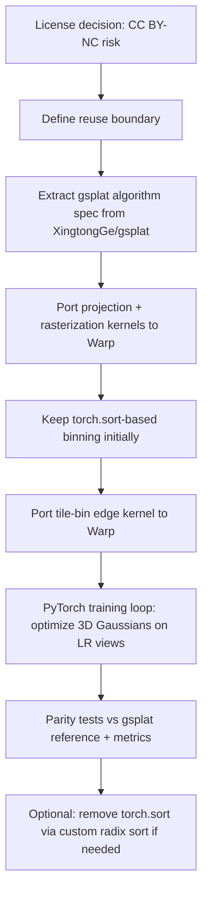

# ContinuousSR Deep Research for a Warp + PyTorch 3D Gaussian Splatting Project

## Executive summary

ContinuousSR is an open-source *reproduction* project for the “Pixel-to-Gaussian” paradigm: it turns a low-resolution image into a **continuous high-resolution 2D signal** by predicting a dense set of **2D Gaussians** (positions, covariances, colors) and then **rasterizing them at arbitrary output scale** using a CUDA Gaussian-splat renderer. citeturn16view2turn16view1

The repo’s practical value for your **multi-view, pose-known 3D Gaussian-splat continuous scene representation** (3DGS-style) is *not* that it provides a 3D pipeline—it doesn’t—but that it gives you (a) an existence proof and implementation pattern for **continuous, arbitrary-scale rasterization via Gaussian splats**, and (b) a compact, inspectable fork of **gsplat** whose CUDA kernels and Python orchestration closely match the standard **tile-binning + sort + rasterize** pipeline you would re-implement in **NVIDIA Warp**. citeturn16view1turn36view1turn33view2turn40search0

Two gating risks dominate:
- **License risk**: the ContinuousSR repo is **CC BY‑NC 4.0 (non-commercial only)**, which makes direct reuse in commercial contexts incompatible unless you get permission. citeturn38view3turn16view2  
- **Kernel dependency risk**: ContinuousSR’s core continuous SR output relies on **custom CUDA extensions** (gsplat) + **PyTorch GPU sort** (torch.sort) for binning/sorting intersections; if your goal is “Warp kernels + PyTorch optimization without extra CUDA extensions,” you should treat gsplat as *reference code* and port the kernels into Warp, possibly keeping `torch.sort` initially as a pragmatic bridge. citeturn14view0turn36view0turn36view1

## What ContinuousSR is trying to do

The project frames arbitrary-scale super-resolution (ASSR) as “explicitly reconstructing 2D continuous HR signals from LR images using Gaussian Splatting,” and claims improved quality and speed through **Deep Gaussian Prior (DGP)–driven covariance weighting** and **adaptive position drifting**. citeturn16view2turn0academia28

The repo also makes two important scope/availability statements:
- It says the “Arxiv version,” “test code,” and a “pretrained model” are released, but that **train code / company-completed code cannot be released** (and it’s a voluntary reproduction). citeturn16view2  
- It advertises “~19.5× speed improvement” and “~0.90 dB PSNR improvement” over prior work (as reported by the repo). citeturn16view2

It also indicates ICLR 2026 acceptance in the repo history/README. citeturn25view0turn24view0

### Core architecture in the released code

The central implementation is `models/gaussian.py`, which defines a PyTorch module registered as `continuous-gaussian`. citeturn16view1

At a high level, it does:

- **Encoder**: `self.encoder = models.make(encoder_spec)` then `PixelUnshuffle(2)` to reshape features. citeturn16view1  
- **Per-Gaussian parameter prediction** from features:
  - Color via an MLP. citeturn16view1  
  - 2D covariance parameters via a **dictionary of Cholesky entries** (`gau_dict` built from discrete value grids) plus an MLP-driven similarity weighting + softmax to mix dictionary entries (this matches the repo’s “covariance weighting” narrative). citeturn16view1turn16view2  
  - Position offsets via `mlp_offset` and a `tanh`, then applied as coordinate perturbations (“adaptive position drifting”). citeturn16view1turn16view2  
- **2D Gaussian projection & rasterization** using `gsplat.project_gaussians_2d` and `gsplat.rasterize_gaussians_sum`, producing an output image at `(H, W)` where `H,W` are computed from the requested scale. citeturn16view1turn36view2turn36view1

So, architecturally, ContinuousSR is **2D Gaussian splatting as an output layer for SR**, not a 3D scene method.

## Paper lineage and what is actually used in-code

ContinuousSR (the paper) is “Pixel to Gaussian: Ultra-Fast Continuous Super-Resolution with 2D Gaussian Modeling” (arXiv 2025; repo notes ICLR 2026 acceptance). citeturn0academia28turn25view0  
In-code, its “Pixel to Gaussian” idea is realized by predicting per-point Gaussian parameters and rasterizing them via gsplat. citeturn16view1turn36view1

GaussianImage (ECCV 2024) appears as the motivation for the **specific gsplat fork** they instruct you to install; the fork calls itself “gsplat submodule for GaussianImage.” citeturn8view0turn27view0  
In practice, ContinuousSR uses that fork as a CUDA Gaussian rasterization backend through imports like:
- `from gsplat.project_gaussians_2d import project_gaussians_2d`
- `from gsplat.rasterize_sum import rasterize_gaussians_sum` citeturn16view1turn36view2turn36view1

The repo also vendors / adapts classic SR backbones (useful for comparisons, not central to your 3DGS plan):
- SwinIR code is explicitly marked as modified from the official SwinIR repo and paper. citeturn17view0turn42search0  
- HAT code is included (and depends on `basicsr` utilities + `einops`). citeturn18view0turn19view0turn39search4turn39search3  
- EDSR and RDN implementations are included as adapted baseline models. citeturn18view1turn18view2turn42search5

For your 3D multi-view Gaussian-splat pipeline, these backbones are optional: you likely optimize geometry/appearance directly in 3D, rather than learning a 2D SR network.

## Dependencies, forks, and CUDA kernel inventory

This section answers: (i) what ContinuousSR depends on, (ii) what those dependencies depend on (transitively), and (iii) where the CUDA kernels live and what they do.

### Table A: Repository-level dependency list, versions, licenses, and risk

| Component | Repo URL (see link block) | Commit / tag / version | License | Role in ContinuousSR | Portability / maintenance risk |
|---|---|---:|---|---|---|
| ContinuousSR | `peylnog/ContinuousSR` | `1eca5914d4b36cf78f250822b9ad2e6a6dc88a12` (main head at time inspected) citeturn25view0turn24view0 | **CC BY‑NC 4.0** (non-commercial) citeturn38view3 | Reproduction/test harness + SR models; calls gsplat for rasterization citeturn16view2turn16view1 | **High license risk** for commercial use; training code not released citeturn16view2 |
| GaussianImage gsplat fork used by ContinuousSR | `XingtongGe/gsplat` | `bcca3ecae966a052e3bf8dd1ff9910cf7b8f851d` citeturn27view0turn26view0 | Apache‑2.0 citeturn8view0turn38view0 | Provides `gsplat.cuda` extension + 2D projection + rasterization APIs used in `models/gaussian.py` citeturn16view1turn36view1turn36view2 | CUDA extension build + ABI friction; pinned by commit only if you pin yourself |
| GLM (vendored as git submodule in gsplat fork) | `g-truc/glm` | commit **unspecified** in ContinuousSR docs (submodule URL is declared) citeturn11view0turn41view0 | “Happy Bunny (Modified MIT) or MIT” (per GLM repo) citeturn37view0 | Linear algebra used in CUDA kernels (`helpers.cuh` includes GLM headers) citeturn33view0turn11view0 | Low risk (header-only), but submodule pin should be audited during vendoring |
| Upstream gsplat (broader ecosystem) | `nerfstudio-project/gsplat` | latest release shown: `v1.5.3` (tag), commit `937e299` (short) citeturn28view0turn9view0 | Apache‑2.0 citeturn9view0turn28view0 | Not a direct install in ContinuousSR, but referenced as code origin/URL in gsplat fork setup.py citeturn14view0turn8view0 | Much more actively maintained; better reference for algorithms/perf features citeturn9view0turn28view0 |
| BasicSR (pip `basicsr==1.3.4.9`) | `XPixelGroup/BasicSR` | pip-pinned (`basicsr==1.3.4.9` in README) citeturn16view2 | Apache‑2.0 citeturn39search4turn39search8 | Utilities + architecture helpers used by HAT code in this repo citeturn18view0turn39search4 | Medium: large toolbox; transitive deps vary |
| timm | `rwightman/timm` (or `pytorch-image-models`) | version **unspecified** in repo docs | Apache‑2.0 citeturn39search2turn17view0 | SwinIR module imports from timm layers (`DropPath`, `trunc_normal_`) citeturn17view0turn39search2 | Low |
| einops | `arogozhnikov/einops` | version **unspecified** in repo docs | MIT citeturn39search3turn18view0 | HAT module uses `einops.rearrange` citeturn18view0turn39search3 | Low |
| HAT upstream (code provenance) | `XPixelGroup/HAT` | **unspecified** | Apache‑2.0 (per LICENSE file) citeturn42search2turn18view0 | ContinuousSR vendors an HAT-like architecture file `models/hat.py` citeturn18view0turn42search6 | Medium: verify provenance + license compatibility if reusing |
| SwinIR upstream (code provenance) | `JingyunLiang/SwinIR` | **unspecified** | license **not verified here from upstream LICENSE** (verify directly) citeturn17view0turn42search0 | ContinuousSR vendors a modified SwinIR implementation citeturn17view0 | Medium: provenance is explicit, but audit upstream license before reuse |
| EDSR upstream (code provenance) | `sanghyun-son/EDSR-PyTorch` | **unspecified** | MIT citeturn42search1turn42search5turn18view1 | Baseline encoder options (EDSR) citeturn18view1 | Low |
| RDN upstream (code provenance) | `yulunzhang/RDN` | **unspecified** | license **unspecified here** (verify upstream) citeturn18view2turn42search3 | Baseline option (RDN) citeturn18view2 | Medium: audit license |

**Important scope note:** ContinuousSR also carries a full `requirements.txt` environment snapshot, but enumerating every transitive Python package and its license is out of scope for this report; the table above focuses on *code-level dependencies*, *repos*, and *anything pulling CUDA/C++ code or higher-risk licenses*. citeturn16view2turn14view0

### Custom CUDA extension: where kernels live and what they implement

The gsplat fork builds a PyTorch CUDA extension (`CUDAExtension`) by globbing `gsplat/cuda/csrc/*.cu` and `*.cpp` and compiling with NVCC flags like `--use_fast_math`. citeturn14view0turn29view0

From the fork’s `csrc` directory listing (non-exhaustive but directly visible), core files include: `forward.cu`, `backward.cu`, `bindings.cu`, `ext.cpp`, plus 2D variants `foward2d.cu`, `backward2d.cu`. citeturn29view0turn33view2turn30view0turn30view2

The extension exports (via `PYBIND11_MODULE`) functions for:
- rasterization forward/backward (including “sum” variants),
- projection forward/backward (3D and 2D),
- spherical harmonics forward/backward,
- utility kernels like `map_gaussian_to_intersects` and `get_tile_bin_edges`. citeturn34view0turn36view1turn36view2turn36view0

A key detail for your Warp plan: **binning/sorting is mostly done in PyTorch**, not in custom CUDA, in this fork:
- `map_gaussian_to_intersects` is a custom CUDA op, but
- sorting uses `torch.sort(isect_ids)` in Python,
- and `get_tile_bin_edges` is custom CUDA again. citeturn36view0turn36view1

That is exactly the division of labor you likely want when gradually porting to Warp: write the heavy per-pixel rasterization in Warp, keep `torch.sort` to avoid implementing a full GPU radix sort in Warp early on, and treat sorting/binning as a non-differentiable “constant” step (which gsplat’s own docs explicitly state). citeturn36view0turn36view1

## Mapping ContinuousSR onto your Warp + PyTorch 3DGS pipeline

You described: multi-view, known intrinsics/extrinsics, LR Blender renders already as PyTorch tensors; build and optimize a **3D Gaussian-splat continuous scene representation**, render arbitrary-scale outputs with **Warp kernels**, optimize with **PyTorch**.

ContinuousSR itself is a *2D* continuous SR layer. So the right question is: what is reusable as-is, what is “reference-only,” and what must be replaced.

### Table B: Module-by-module mapping to Warp/PyTorch actions

| ContinuousSR component | What it does | Warp+PyTorch action | Priority | Notes / compatibility |
|---|---|---|---:|---|
| `models/gaussian.py::ContinuousGaussian` citeturn16view1 | Predicts many 2D Gaussians and rasterizes at arbitrary H×W using gsplat `project_gaussians_2d` + `rasterize_gaussians_sum` citeturn16view1turn36view2turn36view1 | **Replace renderer**, optionally reuse the PyTorch-side parameterization ideas (dictionary-mixed covariance + offset drift) | High | Not a 3D method; but its *rasterize-at-any-resolution* pattern is relevant. The gsplat calls must be replaced by Warp kernels. |
| `gsplat` (XingtongGe fork) python glue (`utils.py`, `rasterize_sum.py`, `project_gaussians_2d.py`) citeturn36view0turn36view1turn36view2 | Implements tile-binning pipeline and autograd wrapper around CUDA | **Use as algorithm spec**, port kernels to Warp; optionally keep `torch.sort` initially | High | Very aligned to your target pipeline. Sorting/binning explicitly “not differentiable” in docs. citeturn36view0turn36view1 |
| gsplat CUDA kernels (`csrc/*.cu`) citeturn29view0turn33view2turn30view0 | Projection to 2D, bbox → tile hits, intersection id generation, rasterization forward/backward | **Port to Warp kernels** (projection + rasterize). Keep binning/sort in PyTorch or re-implement later | High | This is the most direct “CUDA→Warp” port target. |
| `models/swinir.py`, `models/hat.py` citeturn17view0turn18view0 | Heavy SR backbones | Typically **not needed** for 3DGS optimization; only reuse if you want a 2D SR post-process head | Medium | If you keep these, they remain PyTorch modules; Warp won’t replace transformer inference. |
| `datasets/wrappers.py` citeturn23view3 | ASSR dataset sampling (scale sampling/downsampling) | Likely **replace** with your multi-view dataset loader | Low | Your inputs are already tensors + known poses. |
| `utils.py` helpers (PSNR calc, logging, coord sampling) citeturn19view3 | Generic utilities | Reuse selectively | Low | Mostly unrelated to rendering kernels. |

### Kernel replacement mapping diagram

Below is the most faithful mapping from the gsplat fork’s pipeline into “PyTorch orchestration + Warp kernels,” while respecting the observation that sorting/binning is treated as non-differentiable in gsplat and is done via `torch.sort`. citeturn36view0turn36view1turn40search0

```
PyTorch tensors (learned Gaussians)
   │  (means3D, cov/scale+quat, color/SH, opacity)
   ▼
[Warp kernel] project -> per-Gaussian xys, conics, radii, num_tiles_hit
   ▼
[PyTorch] cum_tiles_hit = cumsum(num_tiles_hit)                         (constant)
[Warp or PyTorch] map_gaussian_to_intersects -> isect_ids, gaussian_ids (constant)
[PyTorch] torch.sort(isect_ids) -> isect_ids_sorted, sorted_indices     (constant)
[PyTorch] gather(gaussian_ids, sorted_indices) -> gaussian_ids_sorted   (constant)
[Warp kernel] get_tile_bin_edges(isect_ids_sorted) -> tile_bins         (constant)
   ▼
[Warp kernel] rasterize(tile_bins, gaussian_ids_sorted, xys, conics, colors, opacity)
   ▼
Rendered image (arbitrary resolution)
```

**Tape guidance:** record the Warp rasterization kernel (and any Warp-side projection if you want pose gradients, which you said you do not). Treat sorting/binning as constants (no `wp.Tape` coverage), matching gsplat’s own “not differentiable” stance for those steps. citeturn36view0turn40search0

## CUDA/vendor library usage and whether Warp can replace it

This answers your explicit item (5): what CUDA kernels/vendor libs are required, and replacement/interop options.

- **Custom CUDA**: gsplat is a custom PyTorch C++/CUDA extension built via `torch.utils.cpp_extension.CUDAExtension` compiling `*.cu/*.cpp`. citeturn14view0turn29view0  
  - Warp can replace these kernels *if you port them* (projection, tile binning helpers, rasterization). Warp is explicitly intended for writing high-performance GPU kernels in Python, and its kernels are differentiable. citeturn40search0turn40search3  

- **Sorting**: gsplat’s `bin_and_sort_gaussians()` uses `torch.sort(isect_ids)` in Python. citeturn36view0  
  - Warp does not (as of the cited docs) present a “drop-in global radix sort” primitive; the simplest path is to keep `torch.sort` as a PyTorch op (constant) while Warp handles the kernels that dominate runtime (rasterization). citeturn36view1turn40search0  

- **PyTorch deep learning kernels**: ContinuousSR uses PyTorch models (conv/transformer). Those will use whatever CUDA libraries your PyTorch build uses. ContinuousSR does not show explicit use of Triton kernels in the repo; it is classic PyTorch + a custom CUDA extension. citeturn16view2turn14view0turn17view0  

- **Warp-side acceleration**: Warp includes optional “tile-based programming primitives” introduced in Warp 1.5.0 that leverage cuBLASDx/cuFFTDx for certain tile operations. That’s useful if you ever want to implement dense GEMM/FFT-style kernels inside Warp, but it’s not required for Gaussian rasterization. citeturn40search20turn40search0  

## Prioritized integration plan, porting sketches, effort estimates, and validation

### Integration plan (prioritized)



- **Phase A (0.5–1 person-week): license & provenance audit**  
  Decide whether you can legally reuse ContinuousSR code at all. The repo is CC BY‑NC 4.0. If your project might be commercial, treat ContinuousSR code as “read-only reference” and re-implement from papers and permissively licensed repos. citeturn38view3turn16view2  

- **Phase B (2–4 person-weeks): port the gsplat-style rasterization to Warp (core value)**  
  Port *only* the kernel set you need for your 3DGS renderer: projection (3D→2D), bbox/radii, tile coverage, rasterization (forward; optionally backward). Use PyTorch for sorting/batching initially, just like the gsplat fork does. citeturn36view0turn33view2turn40search0  

- **Phase C (1–2 person-weeks): correctness + perf hardening**  
  Add: culling, early-out thresholds, mixed precision experiments, memory pooling, and stable tests (below). Reference the upstream nerfstudio gsplat docs/releases for known pitfalls and features. citeturn9view0turn28view0  

- **Phase D (optional, 3–6+ person-weeks): remove `torch.sort`**  
  Only if you must eliminate PyTorch sort for performance/graph capture reasons. Otherwise, sort is rarely the bottleneck compared to rasterization and gradient computation.

### Warp kernel porting sketches (from gsplat fork → Warp)

These are sketches, not drop-in code. They are grounded in the gsplat fork’s algorithm shape (tile bbox, intersection IDs, per-tile ranges, per-pixel EWA). citeturn33view2turn33view0turn36view0turn36view1

#### 1) Projection + conic/radius (3DGS-style)

In gsplat, projection computes:
- `xys` (pixel center),
- `conics` (inverse 2D covariance, upper-triangular),
- `radii`,
- `num_tiles_hit` per Gaussian from the tile bbox. citeturn33view2turn33view0

Warp sketch:

```python
# pseudo-warp
@wp.kernel
def project_gaussians(
    means3d: wp.array(dtype=wp.vec3),
    scales: wp.array(dtype=wp.vec3),
    quats: wp.array(dtype=wp.vec4),
    viewmat: wp.mat44,
    projmat: wp.mat44,
    fx: float, fy: float, cx: float, cy: float,
    W: int, H: int,
    tile_w: int, tile_h: int,
    out_xy: wp.array(dtype=wp.vec2),
    out_conic: wp.array(dtype=wp.vec3),
    out_radius: wp.array(dtype=wp.int32),
    out_num_tiles_hit: wp.array(dtype=wp.int32),
):
    i = wp.tid()
    # 1) transform + clip (z)
    # 2) compute 3D covariance from scale+quat (or store cov directly)
    # 3) project covariance to 2D (EWA approximation)
    # 4) invert to conic + compute radius (3-sigma)
    # 5) get tile bbox => num_tiles_hit
```

#### 2) Map Gaussians → intersection IDs (tile_id | depth_id)

The gsplat fork explicitly encodes each Gaussian/tile intersection into an int64 `(tile_id << 32) | depth_bits` and emits `gaussian_ids` for sorting. citeturn33view2turn36view0

Warp sketch:

```python
@wp.kernel
def map_to_intersects(
    # per-Gaussian projection outputs:
    xys: wp.array(dtype=wp.vec2),
    depths: wp.array(dtype=float),
    radii: wp.array(dtype=wp.int32),
    cum_tiles_hit: wp.array(dtype=wp.int32),
    tiles_x: int, tiles_y: int,
    tile_w: int, tile_h: int,
    out_isect: wp.array(dtype=wp.int64),
    out_gid: wp.array(dtype=wp.int32),
):
    g = wp.tid()
    if radii[g] <= 0:
        return

    start = wp.select(g == 0, 0, cum_tiles_hit[g - 1])
    # compute tile bbox of gaussian g
    # for each tile in bbox:
    #   idx = start + local_offset
    #   tile_id = ty*tiles_x + tx
    #   depth_id = bitcast(depths[g]) to int32
    #   out_isect[idx] = (tile_id << 32) | depth_id
    #   out_gid[idx] = g
```

This mirrors the fork’s kernel and keeps sorting external. citeturn33view2turn36view0

#### 3) Tile bin edges (run-length encode by tile_id)

gsplat computes `tile_bins[tile_id] = (start,end)` ranges of the *sorted* intersection array. citeturn33view2turn36view0

Warp sketch (simple boundary-diff approach):

```python
@wp.kernel
def get_tile_bin_edges(
    isect_sorted: wp.array(dtype=wp.int64),
    num_isect: int,
    tile_bins: wp.array(dtype=wp.vec2i),  # (start,end) int2
):
    i = wp.tid()
    if i >= num_isect:
        return
    tile_i = wp.int32(isect_sorted[i] >> 32)

    # initialize edges when tile changes vs previous
    if i == 0:
        tile_bins[tile_i] = wp.vec2i(0, tile_bins[tile_i][1])
    else:
        tile_prev = wp.int32(isect_sorted[i - 1] >> 32)
        if tile_prev != tile_i:
            tile_bins[tile_prev] = wp.vec2i(tile_bins[tile_prev][0], i)
            tile_bins[tile_i] = wp.vec2i(i, tile_bins[tile_i][1])

    if i == num_isect - 1:
        tile_bins[tile_i] = wp.vec2i(tile_bins[tile_i][0], num_isect)
```

#### 4) Rasterization kernel (per-tile, per-pixel alpha compositing)

The core gsplat forward rasterizer loops over Gaussians in a tile and applies an EWA Gaussian weight; it keeps a transmittance `T` and can early terminate. citeturn33view2turn34view2turn36view1

Warp sketch:

```python
@wp.kernel
def rasterize_tiles(
    W: int, H: int,
    tile_w: int, tile_h: int,
    tiles_x: int,
    gaussian_ids_sorted: wp.array(dtype=wp.int32),
    tile_bins: wp.array(dtype=wp.vec2i),
    xys: wp.array(dtype=wp.vec2),
    conics: wp.array(dtype=wp.vec3),
    colors: wp.array(dtype=wp.vec3),     # or SH -> RGB
    opacity: wp.array(dtype=float),
    out_rgb: wp.array2d(dtype=wp.vec3), # HxW
):
    # map tid -> pixel (px,py) and tile_id
    # range = tile_bins[tile_id]
    # T = 1
    # for idx in range: g = gaussian_ids_sorted[idx]
    #   compute exponent from conic and dx,dy
    #   alpha = opacity[g] * exp(-0.5 * quadform)
    #   accumulate: out += T * alpha * color[g]; T *= (1-alpha)
    #   if T < eps: break
```

**Recording vs constant:** You typically record `rasterize_tiles` on `wp.Tape`, while leaving `torch.sort` and tile binning outside the tape (constant), consistent with gsplat’s own “not differentiable” note for mapping/binning. citeturn36view0turn40search0

### Engineering effort estimate (person-weeks)

These are practical estimates for an experienced GPU engineer comfortable in PyTorch + Warp, scoped specifically to “reuse ContinuousSR ideas where safe”:

- **Partial reuse (recommended): 4–8 person-weeks**
  - 0.5–1: license/provenance + minimal reproducible harness
  - 2–4: Warp port of projection + rasterize + tile bin edges
  - 1–2: correctness + gradients + profiling + memory pooling
  - 0.5–1: benchmarking + validation suite  
  This path treats ContinuousSR + gsplat as a reference specification; your deliverable is a Warp rasterizer integrated into a PyTorch optimization loop.

- **Full port (not recommended): 10–18+ person-weeks**
  - Everything above, plus:
  - completing missing training code / re-deriving train pipeline from paper (the repo notes training isn’t released) citeturn16view2  
  - porting or revalidating multiple backbone options (SwinIR/HAT/EDSR/RDN), configs, and datasets; plus more extensive parity testing across ASSR benchmarks.

### Validation tests and benchmarks (parity + performance)

For **renderer correctness (most critical)**:
- Unit test: single Gaussian, compare against CPU reference formula (pixel-center evaluate).
- Tile-bin correctness: ensure `tile_bins` ranges are contiguous and complete (no missing or overlapping indices), matching the gsplat fork’s semantics. citeturn36view0turn33view2  
- Gradient checks: finite differences on (xy, conic, color, opacity) → pixel output; gsplat’s autograd wrapper indicates those are intended differentiable inputs. citeturn36view1

For **end-to-end quality**:
- PSNR/SSIM/LPIPS on your target multi-view task outputs (your project), but also optionally reproduce Set5×4 behavior if you want to sanity check ContinuousSR-like behavior. citeturn20view2turn16view2

For **performance**:
- Measure: time breakdown (projection, map_to_intersects, `torch.sort`, bin edges, rasterize).
- Memory: peak allocated during forward+backward (PyTorch allocator + Warp allocations).

### Table C: Memory & compute cost formulas + example (N=2M, k=8, 1920×1080)

These formulas match the gsplat-style design where each Gaussian hits `k` tiles on average and you materialize per-intersection arrays for sorting. citeturn36view0turn36view1turn33view2

Let:
- `N` = number of Gaussians  
- `k` = avg tiles hit per Gaussian  
- `M = N*k` = total tile intersections  
- `W,H` = image size  
- `B` = tile size (assume 16)  
- `T = ceil(W/B)*ceil(H/B)` = number of tiles  

For `W=1920, H=1080, B=16`: `T = 120 * 68 = 8160` tiles.

| Buffer / cost | Formula | Example value |
|---|---:|---:|
| `isect_ids` (int64) | `8M` bytes | `8 * 16,000,000 ≈ 128 MB` |
| `gaussian_ids` (int32) | `4M` bytes | `≈ 64 MB` |
| Sorted duplicates (if kept simultaneously) | `~(8M + 4M)` extra | `≈ 192 MB` extra |
| Sort indices (often int64) | `8M` bytes | `≈ 128 MB` |
| `tile_bins` (int2 per tile) | `8T` bytes | `8 * 8,160 ≈ 65 KB` |
| Per-Gaussian projection outputs (xys, conic, radius, depth, num_tiles_hit) | ~`(8 + 12 + 4 + 4 + 4)N` bytes | ~`32N ≈ 64 MB` |
| Raster work (naïve, no early-out) | `HW * (M/T)` Gaussian evals | `2.07M * (16M/8160) ≈ 4.1e9 evals` |

**Interpretation:** with `N=2M` and `k=8`, the dominant costs are (i) the **intersection arrays + sort workspace**, and (ii) the **per-pixel inner loop length** `M/T`. This is why practical systems rely heavily on culling, compact radii, and early termination. citeturn33view2turn36view1turn9view0

## Repo/paper links (convenience)

```text
ContinuousSR (reproduction repo):
  https://github.com/peylnog/ContinuousSR

Pixel to Gaussian paper (arXiv):
  https://arxiv.org/abs/2503.06617

ContinuousSR project page (from README):
  https://peylnog.github.io/ContinuousSR_web/

GaussianImage gsplat fork used by ContinuousSR:
  https://github.com/XingtongGe/gsplat

Upstream gsplat (broader 3DGS ecosystem; Apache-2.0):
  https://github.com/nerfstudio-project/gsplat
  https://docs.gsplat.studio/

GLM (gsplat submodule):
  https://github.com/g-truc/glm

BasicSR (basicsr package upstream):
  https://github.com/XPixelGroup/BasicSR
  https://pypi.org/project/basicsr/

Warp (official):
  https://github.com/NVIDIA/warp
  https://nvidia.github.io/warp/
  https://developer.nvidia.com/warp-python

SwinIR (upstream code provenance referenced in repo):
  https://github.com/JingyunLiang/SwinIR

HAT (upstream code provenance referenced by included model):
  https://github.com/XPixelGroup/HAT

EDSR-PyTorch (baseline provenance):
  https://github.com/sanghyun-son/EDSR-PyTorch
```

